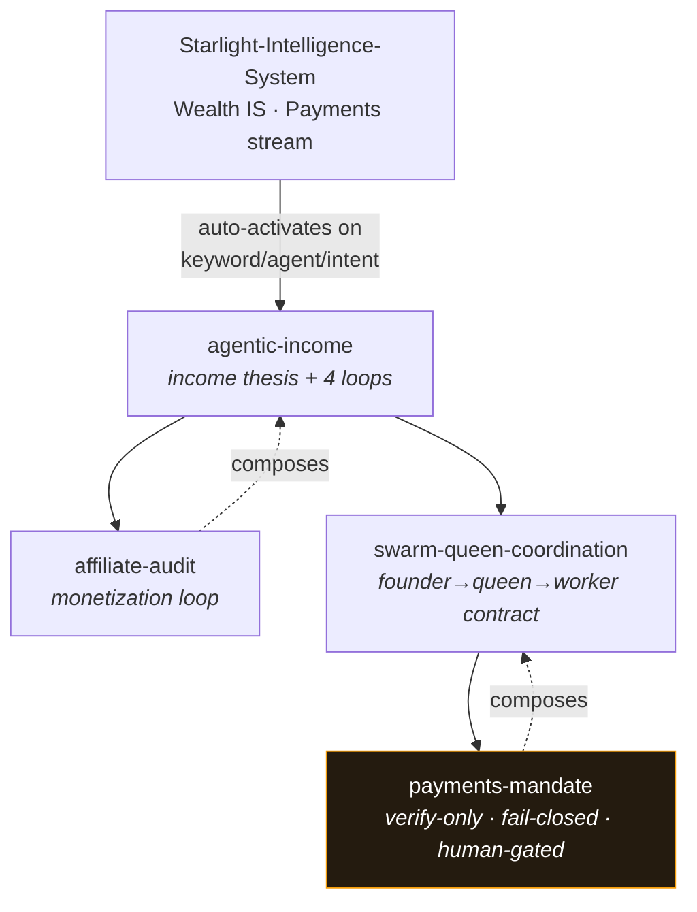

# 🧩 Starlight Agent Skills

### Canonical substrate-level agent skills for the Starlight ecosystem

> Portable, brand-neutral `SKILL.md` capabilities that teach any agent how to build
> income systems safely — the substrate-level twin of `arcanea-agent-skills`. Feeds
> `Starlight-Intelligence-System`; consumed by cosmos-engine runtimes and ACOS.

[**🗂️ Skill index**](#-skill-index) · [**🔌 How SIS consumes these**](#-how-sis-consumes-these) · [**🎯 Scope**](#-scope)

---

> [!NOTE]
> Part of the **Cosmos layer** (see `STARLIGHT-COSMOS.md`). These are *substrate* skills —
> kept deliberately distinct from `arcanea-agent-skills` (product/brand skills) and
> `claude-skills-library` (OSS distribution). Skills **compose** each other rather than duplicate.

---

## 🎯 Scope

- Portable, substrate-level skills (not brand-specific)
- Consumed by cosmos-engine runtimes and ACOS
- Kept distinct from `arcanea-agent-skills` (product/brand skills) and `claude-skills-library` (OSS distribution)

Each skill is a directory with a single `SKILL.md` (YAML frontmatter: `name` / `description` /
`type`, with trigger phrases in the description).

---

## 🗂️ Skill index

| Skill | What it does |
|---|---|
| [`agentic-income`](skills/agentic-income/SKILL.md) | The operating brain for building income systems with AI agents. One thesis, five non-negotiable principles (honest pick wins · recurring > one-time · own the audience · build once, fork many · compounding > spikes), four self-improving loops (monetization · content · authority · learning), and the "what to build next" decision. Composes `affiliate-audit` and hands the money step to `payments-mandate`. |
| [`affiliate-audit`](skills/affiliate-audit/SKILL.md) | The monetization-loop engine: catalog × content × traffic → ranked gaps. Finds which content mentions paying tools without a link and which programs to join first. Composes `agentic-income`. |
| [`payments-mandate`](skills/payments-mandate/SKILL.md) | How an agent safely handles a payment mandate — verify AP2 signed-mandate authorization before any settlement, hold the spend cap, fail closed on doubt, keep a human on every money decision. AP2 proves authorization; it does not move money. Composes `swarm-queen-coordination`. |
| [`swarm-queen-coordination`](skills/swarm-queen-coordination/SKILL.md) | How a stream queen coordinates a worker swarm and runs the escalation contract (worker → queen → founder → human). Queen-led per stream, mesh within a stream; no autonomous money movement. Composes `payments-mandate` + `agentic-income`. |

Activation rules: [`skills/skill-rules.json`](skills/skill-rules.json) — maps each skill to keywords,
agents, and intents in the same schema as `Starlight-Intelligence-System/skills/skill-rules.json`.

---

## 🔌 How SIS consumes these

`Starlight-Intelligence-System` loads these as substrate skills behind its income/payments work.
They compose into one self-improving income loop:

- **`agentic-income`** sits behind the Wealth IS income thesis — a stream queen runs its four loops on a cadence.
- **`affiliate-audit`** is the affiliate stream queen's weekly monetization loop.
- **`payments-mandate`** is the Payments stream's gate — verify-only tools, fail-closed, human-gated cap raises.
- **`swarm-queen-coordination`** maps the founder → queens → workers tiers and enforces the escalation contract.

Each skill's `SKILL.md` ends with a "How SIS consumes this" section. SIS can ingest
`skills/skill-rules.json` directly (matching schema) to auto-activate these on keyword/agent/intent.
Outputs are SIP-attested; the no-autonomous-money-movement and human-gate invariants are non-waivable.

The queen/worker/founder model and the escalation contract are sourced from
[`agentic-ops-hub/docs/AGENT-STACK.md`](../agentic-ops-hub/docs/AGENT-STACK.md). For where this repo
sits in the wider stack (L1 Capability, substrate slice), see
[`agentic-ops-hub/ECOSYSTEM.md`](../agentic-ops-hub/ECOSYSTEM.md).

---

## 🔗 Related

`Starlight-Intelligence-System` · `agentic-creator-os` · `claude-skills-library` · `payment-intelligence-system`

> Created 2026-06-07. Seeded with 4 substrate skills 2026-06-14.

---

**Built on SIP** · Starlight Intelligence Protocol · MIT · _Substrate skills, not brand skills._

